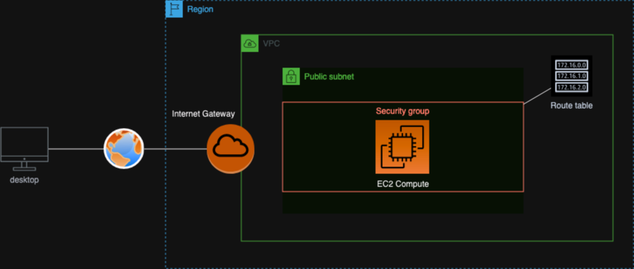
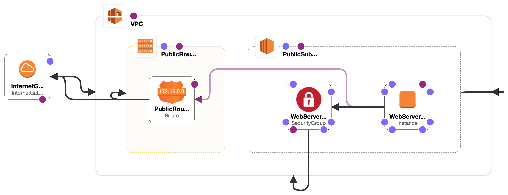

# CloudFormationNPipeline
Automated AWS Infrastructure Deployment using CloudFormation and GitHub Actions

# Infrastructure Overview
Our basic infrastructure for this project will look like the below once completed.

# CloudFormation Designer
Implementing the basic structure with CloudFormation Designer.
